<div align="center">

# 🌲 Planilha Florestal Analytics

### Análise Fitossociológica Simplificada para Inventários Florestais

<p align="center">
  
  
  
</p>

<p align="center">
  <a href="#-features">Features</a> •
  <a href="#-demo">Demo</a> •
  <a href="#-quick-start">Quick Start</a> •
  <a href="#-documentação">Docs</a> •
  <a href="#-contribuir">Contribuir</a>
</p>

**[🚀 Experimente Agora](https://higuchip.github.io/planilha-florestal-analytics/)** • **[📖 Documentação](https://github.com/higuchip/planilha-florestal-analytics/wiki)** • **[🐛 Reportar Bug](https://github.com/higuchip/planilha-florestal-analytics/issues)**

</div>

---

## 🎯 Sobre o Projeto

O **Planilha Florestal Analytics** é uma ferramenta web gratuita e open-source para análise de dados de inventário florestal. Desenvolvida para engenheiros florestais, pesquisadores e estudantes, oferece análises fitossociológicas completas sem necessidade de programação ou software estatístico complexo.

Esta ferramenta complementa o [Planilha Florestal App](https://github.com/higuchip/inventario_app) (PWA para coleta de dados em campo). Importe os arquivos CSV gerados pelo app de campo para realizar análises fitossociológicas completas, incluindo parâmetros estruturais, índices de diversidade, curvas de acumulação e padrões espaciais.

💡 **Dica**: Exporte seus dados do Planilha Florestal App em formato CSV e carregue aqui para análise. No entanto, outros CSVs são aceitos, desde que compatíveis com o padrão esperado.

### ✨ Por que usar?

<table>
  <tr>
    <td align="center" width="33%">
      <h3>🎨 Interface Intuitiva</h3>
      <p>Design limpo e responsivo. Funciona em qualquer dispositivo - desktop, tablet ou mobile.</p>
    </td>
    <td align="center" width="33%">
      <h3>⚡ Análises Instantâneas</h3>
      <p>Carregue seu CSV e obtenha resultados completos em segundos. Sem instalação, sem complicação.</p>
    </td>
    <td align="center" width="33%">
      <h3>📊 Visualizações Profissionais</h3>
      <p>Gráficos interativos prontos para relatórios e publicações científicas.</p>
    </td>
  </tr>
  <tr>
    <td align="center" width="33%">
      <h3>🔒 100% Privado</h3>
      <p>Seus dados nunca saem do seu navegador. Processamento client-side garante privacidade total. Atenção: em computadores públicos ou compartilhados, limpe o cache do navegador após o uso.</p>
    </td>
    <td align="center" width="33%">
      <h3>📦 Exportação Completa</h3>
      <p>Exporte tabelas em CSV e gráficos em PNG. Dados prontos para Excel ou R.</p>
    </td>
    <td align="center" width="33%">
      <h3>🆓 Gratuito e Open Source</h3>
      <p>Código aberto sob licença MIT. Use, modifique e compartilhe livremente.</p>
    </td>
  </tr>
</table>

---

## 🚀 Features

<details open>
<summary><b>📈 Análises Fitossociológicas</b></summary>
<br>

- ✅ **Parâmetros Estruturais**: Densidade Absoluta/Relativa, Frequência Absoluta/Relativa, Dominância Absoluta/Relativa
- ✅ **Índice de Valor de Importância (IVI)**: Classificação automática das espécies
- ✅ **Tabela Fitossociológica Completa**: Pronta para publicação

</details>

<details>
<summary><b>🌿 Índices de Diversidade</b></summary>
<br>

- Shannon-Wiener (H')
- Equabilidade de Pielou (J')
- Simpson (D)
- Riqueza de Espécies (S)
- Interpretações automáticas

</details>

<details>
<summary><b>📊 Análises Estruturais</b></summary>
<br>

- Histogramas de Distribuição Diamétrica (DAP)
- Histogramas de Distribuição de Alturas
- Estatísticas descritivas (média, mediana, CV, min/max)
- Detecção de outliers

</details>

<details>
<summary><b>📉 Curvas de Acumulação</b></summary>
<br>

- Curva observada de acumulação de espécies
- Estimadores de riqueza: Chao 1, Jackknife 1, Bootstrap
- Análise de suficiência amostral

</details>

<details>
<summary><b>🗺️ Padrão Espacial</b></summary>
<br>

- Índice de Morisita para principais espécies
- Classificação: Agregado, Aleatório ou Regular
- Análise por espécie

</details>

<details>
<summary><b>🌳 Estimativa de Biomassa</b></summary>
<br>

- **Modelo Pantropical** (Chave et al., 2014): Florestas tropicais
- **Modelo Amazônico** (Chambers et al., 2001): Amazônia Central
- **Modelo Xaxins** (Ziemmer et al., 2016): Fetos arborescentes
- **Modelo FOM** (Trautenmüller et al., 2021): Floresta Ombrófila Mista
- Biomassa total, por hectare e por espécie
- Tratamento inteligente de dados faltantes

</details>

---

## 🎬 Demo

<div align="center">

### Fluxo de Trabalho

```mermaid
graph LR
    A[📝 Coleta Campo ] --> B[📤 Export CSV]
    B --> C[📊 Import Analytics]
    C --> D[⚙️ Configurar Parcelas]
    D --> E[📈 Analisar]
    E --> F[💾 Exportar Resultados]
    
    style A fill:#90EE90
    style C fill:#87CEEB
    style E fill:#FFD700
    style F fill:#FF6B6B
```



</div>

---

## ⚡ Quick Start

### 1️⃣ Prepare seus dados

Seu CSV deve conter estas colunas:

| Coluna | Obrigatório | Exemplo |
|--------|:-----------:|---------|
| `Parcela` | ✅ | P01 |
| `ID Árvore` | ✅ | 001 |
| `Espécie` | ✅ | *Araucaria angustifolia* |
| `CAP` | ✅ | 95.5 |
| `Altura` | ⚠️* | 15.2 |
| `Latitude` | ❌ | -25.12345 |
| `Longitude` | ❌ | -50.67890 |

> *⚠️ Altura é obrigatória apenas para alguns modelos de biomassa

<details>
<summary>📄 Ver exemplo de CSV</summary>

```csv
Parcela;ID Árvore;Espécie;CAP;Tronco Múltiplo;CAPs Individuais;Altura;Latitude;Longitude;Data de Registro;Observação
1;1469;Ilex dumosa;85,8;Não;;7;-27,79615;-50,332249;25/09/2025, 08:35:33;Coletado 
1;1504;Myrcia splendens;17,7;Não;;6;-27,791664;-50,346441;25/09/2025, 08:35:33;
1;1507;Myrsine umbellata;31,6;Não;;6;-27,791664;-50,346441;25/09/2025, 08:35:33;
1;1509;Myrsine umbellata;15,8;Não;;5;-27,79615;-50,332249;25/09/2025, 08:35:33;
1;1512;Myrcia palustris;26,7;Não;;7;-27,791664;-50,346441;25/09/2025, 08:35:33;
1;1518;Myrsine umbellata;18,4;Não;;6;-27,791664;-50,346441;25/09/2025, 08:35:33;
```

</details>

### 2️⃣ Configure e Analise

1. **Acesse**: [higuchip.github.io/planilha-florestal-analytics](https://higuchip.github.io/planilha-florestal-analytics/)
2. **Configure**: Tamanho das parcelas (presets: 100, 400, 500, 600, 1000 m²)
3. **Importe**: Faça upload do seu CSV
4. **Explore**: Navegue pelas diferentes análises

### 3️⃣ Exporte Resultados

- 📄 **Tabelas**: CSV formatado para Excel/R
- 🖼️ **Gráficos**: PNG de alta resolução
- 📋 **Relatório**: Todos os resultados compilados

---

## 🔗 Ecossistema Planilha Florestal

<div align="center">

```
┌─────────────────────────────────────────────────────────┐
│                    🌲 CAMPO → ESCRITÓRIO                │
└─────────────────────────────────────────────────────────┘

        ┌─────────────────────┐
        │  Planilha Florestal │
        │        App          │ ◄─── 📱 Coleta de Dados
        │        (PWA)        │      (Offline-first)
        └──────────┬──────────┘
                   │
                   │ Export CSV
                   ▼
        ┌─────────────────────┐
        │  Planilha Florestal │
        │     Analytics       │ ◄─── 📊 Análise Completa
        │     (Web App)       │      (Esta ferramenta)
        └─────────────────────┘
```

**[Veja o Planilha Florestal App](https://github.com/higuchip/inventario_app)**

</div>

---

## 🛠️ Tecnologias

<div align="center">


</div>

**Core Libraries:**
- 📊 [Chart.js](https://www.chartjs.org/) - Gráficos interativos
- 📁 [Papa Parse](https://www.papaparse.com/) - Processamento CSV otimizado
- 🖼️ [HTML2Canvas](https://html2canvas.hertzen.com/) - Exportação de gráficos

**Arquitetura:**
- 🎨 CSS Grid/Flexbox para layout responsivo
- ⚡ Vanilla JavaScript (sem frameworks pesados)
- 🔒 100% client-side (zero backend)

---

## 🤝 Contribuir

Contribuições são muito bem-vindas! Este é um projeto colaborativo para a comunidade florestal. 🌳

### 🐛 Encontrou um Bug?

[Abra uma issue](https://github.com/higuchip/planilha-florestal-analytics/issues/new?template=bug_report.md) descrevendo:
- O que aconteceu
- O que deveria acontecer
- Passos para reproduzir
- Screenshot (se possível)

### 💡 Tem uma Ideia?

[Sugira uma feature](https://github.com/higuchip/planilha-florestal-analytics/issues/new?template=feature_request.md) explicando:
- Qual problema resolve
- Como funcionaria
- Casos de uso

### 👨‍💻 Quer Contribuir com Código?

1. Fork o projeto
2. Crie sua feature branch (`git checkout -b feature/MinhaFeature`)
3. Commit suas mudanças (`git commit -m 'Add: Nova funcionalidade incrível'`)
4. Push para o branch (`git push origin feature/MinhaFeature`)
5. Abra um Pull Request

**Leia nosso [Guia de Contribuição](CONTRIBUTING.md) para mais detalhes.**

### 🎯 Áreas que Precisam de Ajuda

- [ ] 📝 Documentação e tutoriais
- [ ] 🌐 Tradução para inglês/espanhol
- [ ] 🧪 Testes automatizados
- [ ] 🎨 Melhorias na UI/UX
- [ ] 📊 Novas visualizações
- [ ] 🔬 Validação científica dos cálculos

---

## 📊 Status do Projeto

<div align="center">


</div>

### 🗺️ Roadmap

- [ ] Explorar novas análises e visualizações
- [ ] Criar visualização de mapas com coordenadas
- [ ] Verificar erros e bugs
- [ ] Criar documentação técnica detalhada

---

## 📄 Licença

<div align="center">

[](https://opensource.org/licenses/MIT)

**Licenciado sob a [Licença MIT](LICENSE)**

</div>

---

## 🙏 Agradecimentos

Este projeto foi desenvolvido como parte de pesquisas em ecologia florestal e não seria possível sem:

- 🎓 **Comunidade científica florestal brasileira**
- 💻 **Desenvolvedores de bibliotecas open-source**
- 🌲 **Todos que contribuíram com feedback e sugestões**

### 📚 Referências Científicas Principais

- Chave et al. (2014) - Equações alométricas pantropicais
- Chambers et al. (2001) - Biomassa Amazônica
- Ziemmer et al. (2016) - Biomassa de xaxins
- Trautenmüller et al. (2021) - Biomassa FOM
- Mueller-Dombois & Ellenberg (1974) - Métodos fitossociológicos

---

## 👨‍💻 Autor

<div align="center">


**Pedro Higuchi**

Professor Depto Engenharia Florestal/UDESC | Pesquisador em Ecologia de Florestas Ombrófilas Mistas

[](https://github.com/higuchip)
[](mailto:higuchip@gmail.com)

</div>

---

<div align="center">

### ⭐ Se este projeto foi útil para você, considere dar uma estrela!

**Desenvolvido com 💚 para a comunidade florestal brasileira**

[⬆ Voltar ao topo](#-planilha-florestal-analytics)

</div>
